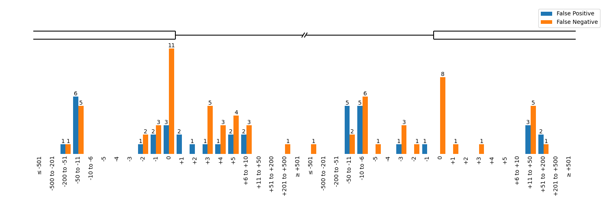

# Project Links
This repository is part of the [CI-SpliceAI](https://ci-spliceai.com) software package published in [PLOS One](https://doi.org/10.1371/journal.pone.0269159).

This is the project comparing different splice prediction tools on variant data. You may also be interested in the [code to train CI-SpliceAI](https://github.com/YStrauch/CI-SpliceAI__Train), [code to use trained models to annotate variants offline](https://github.com/YStrauch/CI-SpliceAI__Annotation), and the [website providing online annotation of variants](https://ci-spliceai.com).

# Abstract
In this project, we are evaluating 6 different splice prediction tools (one of which is ours called [CI-SpliceAI](https://ci-spliceai.com)) on a corpus of:
- 1,317 variants for a binary affecting/non-affecting task; and
- 388 variants (subset of the first corpus) with annotations of their exact variant effect

This repository contains all [variants](variants/) and all code to re-produce the results obtained.

# Variant Data
Visualisations of the [variants](variants/):

# Results
## Optimal Thresholds, PR-AUC, PR-ROC, and optimal Accuracy
| Algorithm                      | Coverage   | AUC-PR   | AUC-ROC   |   Optimal Threshold | Accuracy   |
|:-------------------------------|:-----------|:---------|:----------|--------------------:|:-----------|
| MES (Sliding)                  | 100%       | 55.68%   | 52.97%    |              12.5   | 53.42%     |
| SQUIRLS                        | 100%       | 91.32%   | 91.17%    |               0.074 | 85.64%     |
| MES (VEP)                      | 58%        | 92.52%   | 89.15%    |               2.109 | 86.40%     |
| MMSplice (Splicing Efficiency) | 99%        | 93.03%   | 92.56%    |               1.119 | 87.23%     |
| MMSplice (Pathogenicity)       | 99%        | 94.13%   | 92.84%    |               0.961 | 88.53%     |
| SpliceAI                       | 99%        | 96.21%   | 95.65%    |               0.3   | 90.88%     |
| CI-SpliceAI                    | 100%       | 97.25%   | 96.75%    |               0.19  | 92.17%     |

## Predictive error between CI-SpliceAI and SpliceAI

## Exact variant effect prediction accuracy
| Algorithm     | Acceptor Gain   | Acceptor Loss   | Donor Gain   | Donor Loss   |
|:--------------|:----------------|:----------------|:-------------|:-------------|
| MES (Sliding) | 0.00%           | 1.16%           | 2.33%        | 2.25%        |
| SpliceAI      | 87.50%          | 77.10%          | 79.07%       | 78.93%       |
| CI-SpliceAI   | 93.75%          | 78.55%          | 79.07%       | 82.02%       |

## CI-SpliceAI Mispredictions

# Methods
These steps were taken:

## CSV to VCF
The [variant csv file](variants.csv) was parsed into vcf format and normalised (index, normalise rows, align left).

The resulting [vcf file](variants.vcf) is checked in this repository, so you don't need to run [the code producing it](csv_to_vcf/main.sh).

## Running tools
We ran all tools on the [vcf file](variants.vcf) using [predict.sh](predict.sh).

Results are checked into [predictions/](predictions).

## Analysis
Variant data and predictions were analysed and plotted using [analysis.sh](analysis.sh) into [analysis/](analysis).

# Setup
This project is built on bash scripts. We suggest running it on a UNIX system; it might be possible to run it on windows using a bash environment like git bash, this is however untested and unsupported.

Before running the setup code, make sure you agree to all licences of third-party components.

Please make sure to install these manual dependencies first:
- [Install conda](https://docs.conda.io/projects/conda/en/latest/user-guide/install/index.html)
- [Install VEP CLI on Docker](https://grch37.ensembl.org/info/docs/tools/vep/script/vep_download.html#docker) and make sure to follow the section linking a volume hosted on ~/vep_data 
- Install the [MES plugin](https://github.com/Ensembl/VEP_plugins/blob/release/105/MaxEntScan.pm) into your VEP CLI and ensure that MES runs

Then run [setup.sh](setup.sh) which will automatically:
- Create conda environments with SpliceAI, CI-SpliceAI and MMSplice (through kipoi)
- Download all third party elements like:
    - SQUIRLS command line, jannovar annotations, database
    - the human reference genome
    - GENCODE annotations for MMSplice
- Pre-process GENCODE annotations for MMSplice

# Licensing
 This work is licensed under a <a rel="license" href="http://creativecommons.org/licenses/by/4.0/">Creative Commons Attribution 4.0 International License</a>.

By running this code, you are installing third-party software. It is your responsibility to assure that you are following all third party licenses.